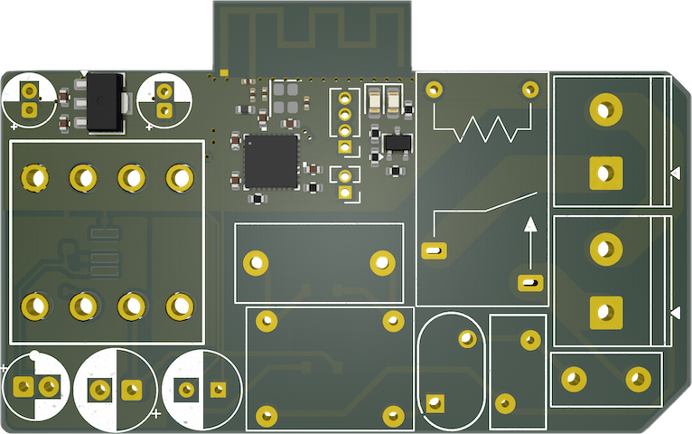

# Matter-Enabled Thread Switch on ESP32-H2

This repository contains a minimal Matter + Thread project targeting the **ESP32-H2** MCU. It controls a relay with the aim of managing a water heater or similar appliance. The project is written in **C++20** (with some C code) using the **ESP-IDF** and **ESP-Matter** frameworks.

## Overview
* **Core MCU**: [ESP32-H2](https://www.espressif.com/en/products/socs/esp32-h2)
* **Protocol**: Matter over Thread
* **Relay Control**: GPIO27
* **Status LED**: GPIO26
* **Language**: C++20 & C
* **Thread Config**: Enabled by default in sdkconfig.defaults
* **Commissioning Data**: Stored in a factory partition (fctry) at 0x3E0000


## Hardware

### Board Overview




The ESP32-H2 Switch is designed for controlling high-voltage appliances with safety in mind. The board features:

- Compact dimensions for easy installation
- Clearly labeled connectors and indicators
- High-quality relay rated for 220V and up to 10A current

### Dimensions & Mounting


The board measures 54.56mm x 28.64mm and is designed to be installed inside existing devices or enclosures.

### Pinout & Connections


Important connections:
- **AC Input/Output**: Screw terminals on the left side for line (phase) and neutral input and output
- **Status LEDs**: Located at the bottom above the antenna
  - LED_RELAY: Indicates relay activation status
  - LED_RUN: Indicates device operational status
- **Debug Headers**: UART pins for flashing and debugging (from top to bottom: +3.3V, TX, RX, GND)
- **Control Pins**: BOOT and RESET pins (must be manually shorted to GND to activate)

**Safety Note**: All power lines are routed on the bottom layer of the PCB. Exercise extreme caution during installation to avoid contact with these traces when connected to mains power.

### Hardware Variants
The project includes KiCad PCB and schematic files in the `hardware/` directory with two variants:
- `smd/`: Surface-mounted component design (more compact)
- `tht/`: Through-hole component design (easier to assemble manually)

**Note**: The hardware designs depend on a custom KiCad component library. To open and edit the schematics:
1. Install the component library from https://github.com/sivakov512/kicad-library
2. Follow the installation instructions in that repository

## Software

### Requirements
1. [ESP-IDF 5.4](https://github.com/espressif/esp-idf/tree/release/v5.4)
    - Follow the official ESP-IDF [documentation](https://docs.espressif.com/projects/esp-idf/en/stable/esp32h2/get-started/index.html#installation) for installation and setup.
2. [ESP-Matter 1.4](https://github.com/espressif/esp-matter/tree/release/v1.4)
    - Refer to the ESP-Matter repo for detailed instructions on integrating Matter into ESP-IDF.

### Setup

1. Clone this repository alongside your ESP-IDF and ESP-Matter installations.
2. Ensure that `sdkconfig.defaults` includes the necessary Thread and Matter configurations for ESP32-H2.
3. Verify that `GPIO27` is free to drive your relay hardware and `GPIO26` for the status LED.

### Project Structure
Typical ESP-IDF directory layout:
```project_root/
├── CMakeLists.txt
├── sdkconfig.defaults
├── main/
│   ├── main.cpp
│   └── ...
├── hardware/
│   ├── smd/
│   └── tht/
├── docs/
│   └── images/
└── partitions.csv
```

### Building

1. Set the target to **esp32h2**:
```sh
idf.py set-target esp32h2
```

2. Build the firmware:
```sh
idf.py build
```

3. Flash to your device (initial firmware, excluding commissioning info):
```sh
idf.py flash
```

### Commissioning Data (Factory Partition)

To avoid using test keys in production, generate your own commissioning data and flash it to the `fctry` partition at address `0x3E0000`.
* We recommend using [ESP Matter Manufacturing Tool (mfg_tool)](https://github.com/espressif/esp-matter-tools/tree/main/mfg_tool).
* Example command (using test keys) for building provisioning data:
```sh
esp-matter-mfg-tool -v 0xFFF2 -p 0x8001 \
  --vendor-name "Nikita Sivakov" \
  --product-name "Switch" \
  -cd $MATTER_SDK_PATH/credentials/test/certification-declaration/Chip-Test-CD-FFF2-8001.der
```
This generates a binary that contains the necessary credentials for Matter commissioning.

#### Flashing the Commissioning Binary
Once the binary is generated, flash it to `0x3E0000`:
```sh
esptool.py -p <DEVICE_PORT> write_flash 0x3E0000 <PATH_TO_GENERATED_BINARY>
```
*Replace `<DEVICE_PORT>` (e.g. `COM3` or `/dev/ttyUSB0`) and `<PATH_TO_GENERATED_BINARY>` with your actual values.*

## Usage and Operation

### Initial Setup
1. Mount the board in a suitable enclosure.
2. Connect the power and load wires according to the pinout diagram.
3. Power up the board.

### Software Setup
1. Join a Thread network and start the Matter commissioning process.
2. Use a Matter controller (Apple Home, Google Home, or other Matter-compatible hub) to add the device.
3. Once commissioned, toggle the relay through Matter commands.

### Status Indicators
- **LED_RUN**: Indicates that the device is operating properly
- **LED_RELAY**: Indicates when the relay is activated

## Contributing
* For any issues, suggestions, or feature requests, please open an [issue](../../issues).
* Pull requests with improvements or bug fixes are welcome.

## Safety Warning

**IMPORTANT**: This device controls high-voltage appliances. Improper installation may result in electric shock or fire hazards.

- Always disconnect power before installation or maintenance
- Install in a suitable enclosure
- Follow all local electrical codes and regulations
- If you're not qualified to work with high-voltage equipment, consult a licensed electrician

---

**Note**: This project is provided as-is for demonstration purposes. Always exercise caution when dealing with high-voltage equipment such as water heaters.
